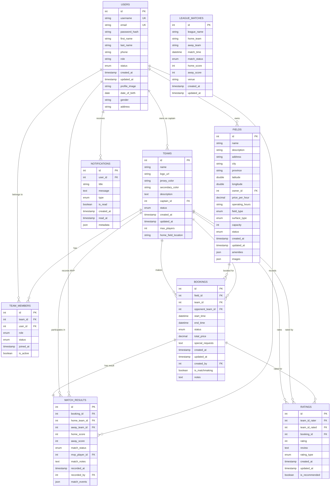

# Football Field Booking App

A comprehensive web application for booking football fields and organizing matches in Cambodia, connecting teams, field owners, and football enthusiasts.

## 📋 Project Overview

The Football Field Booking App serves as a centralized platform that bridges field owners and football teams, offering streamlined booking management, automatic opponent matchmaking, and community engagement features. The application also keeps fans engaged with updates from major European leagues.

## 🎯 Key Features

### For Players & Teams
- **Field Booking**: Browse and book available football fields
- **Matchmaking**: Find opponents for matches automatically
- **Team Management**: Create and manage team profiles, logos, and members
- **Match History**: Track performance, statistics, and rankings
- **Jersey Selection**: Choose team colors with conflict detection

### For Field Owners
- **Field Management**: Add and manage multiple field locations
- **Schedule Control**: Set operating hours, pricing, and availability
- **Booking Management**: Confirm, cancel, and modify bookings
- **Match Results**: Record scores and select MVPs
- **Revenue Tracking**: Monitor field utilization and earnings

### For Football Fans
- **League Updates**: Follow English, Spanish, Italian, and Champions League matches
- **Live Scores**: Real-time match results and standings
- **Top Scorers**: Track leading goal scorers across leagues

## 👥 User Roles

| Role | Permissions |
|------|-------------|
| **Guest** | View fields, schedules, league matches |
| **Player/Team Captain** | Register teams, book fields, join matches, manage team members |
| **Field Owner/Admin** | Create fields, manage schedules, confirm bookings, set pricing |

## 🏗️ Complete Technology Stack

### **Frontend Technologies**

#### **Core Framework & Libraries**
- **React 19.2.0** - Modern UI library with hooks and concurrent features
- **React DOM 19.2.0** - React renderer for web browsers
- **React Router DOM 7.13.0** - Client-side routing and navigation

#### **Build Tools & Development Environment**
- **Vite 7.3.1** - Fast build tool and development server
- **@vitejs/plugin-react 5.1.1** - React plugin for Vite
- **ESLint 9.39.1** - Code linting and quality checks
- **ESLint Plugins**:
  - **eslint-plugin-react-hooks 7.0.1** - React hooks linting
  - **eslint-plugin-react-refresh 0.4.24** - React refresh linting
- **TypeScript Support**:
  - **@types/react 19.2.7** - React type definitions
  - **@types/react-dom 19.2.3** - React DOM type definitions
- **Globals 16.5.0** - Global variable definitions for ESLint

#### **UI Components & Styling**
- **Lucide React 0.564.0** - Modern icon library with 400+ icons
- **CSS3** - Custom styling with CSS variables and responsive design
- **CSS Grid & Flexbox** - Modern layout systems
- **CSS Custom Properties** - Theme variables for consistent design

#### **HTTP Client & API Communication**
- **Axios 1.13.5** - Promise-based HTTP client with interceptors and error handling

#### **Module System**
- **ES Modules** (`"type": "module"`) - Modern JavaScript module system

---

### **Backend Technologies**

#### **Runtime & Framework**
- **Node.js 24.11.1** - JavaScript runtime environment with V8 engine
- **Express.js 5.2.1** - Fast, minimalist web application framework
- **CommonJS** (`"type": "commonjs"`) - Traditional Node.js module system

#### **Database & Data Management**
- **MySQL/MariaDB 10.4.32** - Relational database management system
- **mysql2 3.17.2** - MySQL driver for Node.js with improved performance and prepared statements

#### **Authentication & Security**
- **jsonwebtoken 9.0.3** - JWT (JSON Web Token) implementation for secure authentication
- **bcryptjs 3.0.3** - Password hashing and security with salt rounds
- **Role-Based Access Control** - Middleware for permission management

#### **Middleware & Utilities**
- **cors 2.8.6** - Cross-Origin Resource Sharing middleware
- **dotenv 17.3.1** - Environment variable management from .env files
- **Express JSON Parser** - Built-in JSON request body parsing
- **Custom Authentication Middleware** - JWT verification and role checking

---

### **Development Tools & Environment**

#### **Package Management**
- **npm 11.6.2** - Node package manager with dependency locking
- **package-lock.json** - Dependency locking for reproducible builds

#### **Version Control**
- **Git** - Distributed version control system
- **.gitignore** - Git ignore configuration for Node.js projects

#### **Code Quality & Linting**
- **ESLint Configuration** - Flat config format with React and JavaScript rules
- **React Refresh** - Fast refresh for development experience
- **Custom ESLint Rules** - Project-specific linting configurations

---

### **System Architecture**

#### **Architecture Pattern**
- **MERN Stack Variant** (MongoDB → MySQL, Express, React, Node)
- **RESTful API** - Standard HTTP methods with proper status codes
- **Client-Server Architecture** - Separation of concerns between frontend and backend
- **Service-Oriented Architecture** - Modular controller and route structure

#### **API Design**
- **JWT Authentication** - Token-based authentication with Bearer tokens
- **Role-Based Authorization** - Multi-level permission system (guest, player, field_owner, admin)
- **CORS Enabled** - Cross-origin resource sharing for frontend-backend communication
- **Error Handling** - Centralized error handling with proper HTTP status codes
- **Input Validation** - Request body validation and sanitization

#### **Database Architecture**
- **Relational Model** - Foreign key relationships and constraints
- **MySQL Features**:
  - Stored procedures and functions
  - Database triggers and events
  - Indexing for performance optimization
  - ACID compliance for data integrity
- **Database Schema**:
  - **Users** - Authentication and profile management
  - **Fields** - Football field information and management
  - **Bookings** - Reservation system with scheduling
  - **Teams** - Team management and member relationships
  - **Ratings** - Review and rating system
  - **Notifications** - User communication system
  - **League Matches** - External league data integration

---

### **Development Environment Setup**

#### **Operating System**
- **Windows** - Primary development environment
- **PowerShell** - Command-line interface and scripting

#### **Development Servers**
- **Frontend Dev Server**: Vite development server (typically port 5173)
- **Backend API Server**: Express.js server (port 5000)
- **Database Server**: MySQL/MariaDB (localhost:3306)

#### **Environment Configuration**
- **.env Files** - Environment-specific configuration
- **Environment Variables**:
  - Database connection parameters
  - JWT secret keys
  - Server port configuration
  - CORS settings

---

### **Performance & Optimization**

#### **Frontend Optimization**
- **Code Splitting** - Vite's automatic code splitting
- **Tree Shaking** - Dead code elimination
- **Fast Refresh** - Hot module replacement for development
- **Asset Optimization** - Automatic image and font optimization

#### **Backend Optimization**
- **Connection Pooling** - MySQL connection management
- **Middleware Optimization** - Efficient request processing
- **Error Handling** - Graceful error recovery
- **Memory Management** - Proper garbage collection practices

#### **Database Optimization**
- **Indexing Strategy** - Optimized indexes for common queries
- **Query Optimization** - Efficient SQL queries with proper joins
- **Connection Management** - Persistent database connections
- **Caching Strategy** - Planned Redis integration for future releases

---

### **Security Implementation**

#### **Authentication Security**
- **JWT Tokens** - Secure token-based authentication with expiration
- **Password Hashing** - bcrypt with salt rounds for password security
- **Role-Based Access** - Granular permission control
- **Token Validation** - Middleware-based token verification

#### **API Security**
- **CORS Configuration** - Controlled cross-origin access
- **Input Validation** - Request body validation and sanitization
- **Error Handling** - Secure error responses without information leakage
- **Environment Variables** - Secure configuration management

#### **Development Security**
- **Dependency Management** - Regular security updates via npm
- **Code Quality** - ESLint rules for secure coding practices
- **Git Security** - Proper .gitignore for sensitive files

---

### **Testing & Quality Assurance**

#### **Testing Framework Setup**
- **ESLint** - Code quality and style checking
- **React Refresh Testing** - Development experience validation
- **API Testing** - Manual testing via curl and Postman
- **Database Testing** - SQL query validation and performance testing

#### **Quality Metrics**
- **Code Linting** - Automated code quality checks
- **Type Safety** - TypeScript definitions for better development experience
- **Performance Monitoring** - API response time tracking
- **Error Tracking** - Comprehensive error logging and monitoring

---

### **Deployment & Production**

#### **Build Process**
- **Frontend Build** - Vite production build with optimization
- **Backend Deployment** - Node.js production environment setup
- **Database Migration** - MySQL schema management
- **Environment Configuration** - Production environment setup

#### **Production Considerations**
- **Process Management** - PM2 or similar for process management
- **Load Balancing** - Scalability considerations
- **Monitoring** - Application performance monitoring
- **Backup Strategy** - Database backup and recovery planning

---

### **Technology Version Summary**

| Technology | Version | Purpose |
|-------------|---------|---------|
| **Node.js** | 24.11.1 | JavaScript Runtime |
| **npm** | 11.6.2 | Package Manager |
| **React** | 19.2.0 | Frontend Framework |
| **React Router** | 7.13.0 | Client-side Routing |
| **Vite** | 7.3.1 | Build Tool & Dev Server |
| **Express** | 5.2.1 | Backend Framework |
| **MySQL/MariaDB** | 10.4.32 | Database |
| **mysql2** | 3.17.2 | MySQL Driver |
| **JWT** | 9.0.3 | Authentication |
| **bcryptjs** | 3.0.3 | Password Security |
| **Axios** | 1.13.5 | HTTP Client |
| **Lucide React** | 0.564.0 | Icon Library |
| **ESLint** | 9.39.1 | Code Quality |
| **CORS** | 2.8.6 | Cross-Origin Sharing |
| **dotenv** | 17.3.1 | Environment Management |

## 🚀 Getting Started

### Prerequisites
- Node.js (v16 or higher)
- MySQL (v8.0 or higher)
- Redis (v6.0 or higher)
- Git

### Installation

1. **Clone the repository**
   ```bash
   git clone https://github.com/your-username/Football-Field-Booking-App.git
   cd Football-Field-Booking-App
   ```

2. **Install dependencies**
   ```bash
   # Backend dependencies
   cd backend
   npm install
   
   # Frontend dependencies
   cd ../frontend
   npm install
   ```

3. **Database Setup**
   ```bash
   # Create MySQL database
   mysql -u root -p
   CREATE DATABASE football_booking;
   
   # Import database schema
   mysql -u root -p football_booking < database/schema.sql
   ```

4. **Environment Configuration**
   ```bash
   # Backend environment variables
   cd backend
   cp .env.example .env
   # Edit .env with your database credentials and JWT secret
   
   # Frontend environment variables
   cd ../frontend
   cp .env.example .env
   # Edit .env with API endpoints
   ```

5. **Start the application**
   ```bash
   # Start backend server
   cd backend
   npm run dev
   
   # Start frontend (in new terminal)
   cd frontend
   npm start
   ```

6. **Access the application**
   - Frontend: http://localhost:3000
   - Backend API: http://localhost:5000
   - API Documentation: http://localhost:5000/api-docs

## 📊 Database Schema

### Entity Relationship Diagram (ERD)



### Core Tables Description

#### **Users**
- **Purpose**: Stores user authentication and profile information
- **Key Fields**: id, username, email, password_hash, role, status
- **Roles**: Guest, Player/Team Captain, Field Owner/Admin

#### **Teams**
- **Purpose**: Team details and configuration
- **Key Fields**: id, name, logo_url, captain_id, jersey_color, status
- **Features**: Team identity, jersey management, member limits

#### **Team_Members**
- **Purpose**: Many-to-many relationship between users and teams
- **Key Fields**: team_id, user_id, role, status, joined_at
- **Roles**: Captain, Player, Substitute

#### **Fields**
- **Purpose**: Football field information and management
- **Key Fields**: id, name, owner_id, price_per_hour, operating_hours, status
- **Features**: Location data, pricing, amenities, availability

#### **Bookings**
- **Purpose**: Field reservation records and scheduling
- **Key Fields**: field_id, team_id, start_time, end_time, status, total_price
- **Features**: Matchmaking support, opponent assignment, status tracking

#### **Match_Results**
- **Purpose**: Game outcomes and performance tracking
- **Key Fields**: booking_id, home_score, away_score, mvp_player_id, match_status
- **Features**: Score tracking, MVP selection, match events

#### **Ratings**
- **Purpose**: Team reviews and community feedback system
- **Key Fields**: team_id_rater, team_id_rated, booking_id, rating, review
- **Features**: Star ratings, text reviews, recommendations

#### **Notifications**
- **Purpose**: Real-time alerts and user communication
- **Key Fields**: user_id, title, message, type, is_read
- **Features**: Push notifications, read status, metadata storage

#### **League_Matches**
- **Purpose**: External league data integration
- **Key Fields**: league_name, home_team, away_team, match_time, scores
- **Features**: European leagues, live scores, match schedules

### Entity Relationships Summary
```
Users 1--1 Teams (as captain)
Users 1--M Fields (as owner)
Users M--M Teams (as members)
Teams M--M Bookings (as booker and opponent)
Fields 1--M Bookings
Bookings 1--1 Match_Results
Teams M--M Ratings (rater and rated)
Users 1--M Notifications
```

### Database Constraints & Indexes

#### **Primary Keys (PK)**
- All tables have auto-incrementing `id` as primary key

#### **Foreign Keys (FK)**
- `teams.captain_id` → `users.id`
- `fields.owner_id` → `users.id`
- `team_members.team_id` → `teams.id`
- `team_members.user_id` → `users.id`
- `bookings.field_id` → `fields.id`
- `bookings.team_id` → `teams.id`
- `bookings.opponent_team_id` → `teams.id`
- `match_results.booking_id` → `bookings.id`
- `match_results.mvp_player_id` → `users.id`

#### **Unique Constraints**
- `users.username`, `users.email`
- `teams.name` (per owner)

#### **Indexes for Performance**
- `bookings.start_time`, `bookings.end_time` (for availability checks)
- `users.email` (for login)
- `fields.status`, `fields.city` (for search and filtering)
- `teams.status` (for active team listings)

## 🔐 Security Features

- **JWT Authentication** - Secure token-based API access
- **Role-Based Access Control** - Strict permission enforcement
- **Password Encryption** - bcrypt hashing for password security
- **HTTPS/TLS 1.3** - Encrypted data transmission
- **Input Validation** - Sanitization against XSS and SQL injection
- **Rate Limiting** - Protection against abuse and DDoS attacks

## 📈 Performance Metrics

- **Page Load Time**: < 2 seconds
- **API Response Time**: < 500ms for 95% of requests
- **Concurrent Users**: Support for 200+ daily matches
- **Uptime**: 99.9% availability target

## 🌐 API Endpoints

### Authentication
- `POST /api/auth/register` - User registration
- `POST /api/auth/login` - User login
- `POST /api/auth/logout` - User logout

### Fields
- `GET /api/fields` - List all available fields
- `POST /api/fields` - Create new field (Owner only)
- `PUT /api/fields/:id` - Update field details
- `DELETE /api/fields/:id` - Remove field

### Bookings
- `GET /api/bookings` - List user bookings
- `POST /api/bookings` - Create new booking
- `PUT /api/bookings/:id` - Update booking
- `DELETE /api/bookings/:id` - Cancel booking

### Teams
- `GET /api/teams` - List teams
- `POST /api/teams` - Create team
- `PUT /api/teams/:id` - Update team details
- `POST /api/teams/:id/join` - Join team as member

## 🔧 Development Tools

- **VS Code** - Primary code editor
- **Postman** - API testing and documentation
- **MySQL Workbench** - Database management
- **GitHub** - Version control and collaboration
- **Figma** - UI/UX design prototyping

## 📱 Mobile Responsiveness

The application is fully responsive and works seamlessly across:
- Desktop computers (1920x1080 and above)
- Tablets (768px - 1024px)
- Mobile devices (320px - 768px)

## 🌍 Internationalization

- **Primary Language**: English
- **Secondary Language**: Khmer (Cambodian)
- **RTL Support**: Planned for future releases

## 🧪 Testing

### Running Tests
```bash
# Backend tests
cd backend
npm test

# Frontend tests
cd frontend
npm test

# Integration tests
npm run test:integration

# Coverage report
npm run test:coverage
```

### Test Categories
- **Unit Tests** - Individual component and function testing
- **Integration Tests** - API endpoint and database interaction testing
- **E2E Tests** - Complete user workflow testing

## 📦 Deployment

### Production Deployment
1. **Build the application**
   ```bash
   # Frontend build
   cd frontend
   npm run build
   
   # Backend production setup
   cd backend
   npm run build
   ```

2. **Environment Setup**
   - Configure production environment variables
   - Set up SSL certificates
   - Configure database connections

3. **Server Deployment**
   ```bash
   # Using PM2 for process management
   pm2 start ecosystem.config.js
   
   # Or using Docker
   docker-compose up -d
   ```

## 🤝 Contributing

1. Fork the repository
2. Create a feature branch (`git checkout -b feature/AmazingFeature`)
3. Commit your changes (`git commit -m 'Add some AmazingFeature'`)
4. Push to the branch (`git push origin feature/AmazingFeature`)
5. Open a Pull Request

### Code Style Guidelines
- Use ESLint for JavaScript/TypeScript linting
- Follow Prettier formatting rules
- Write meaningful commit messages
- Include tests for new features

## 📄 License

This project is licensed under the MIT License - see the [LICENSE](LICENSE) file for details.

## 👥 Development Team

- **Scrum Master**: Phan Phoun
- **QA Testers**: Luch Samart, Pon Makara
- **Developers**: Soeng Chamrourn, Rose Rourn
- **Mentor**: Rady

## 📞 Support

For support and inquiries:
- **Email**: support@footballbooking.app
- **Documentation**: [Project Wiki](https://github.com/your-username/Football-Field-Booking-App/wiki)
- **Issues**: [GitHub Issues](https://github.com/your-username/Football-Field-Booking-App/issues)

## 🗺️ Roadmap

### Phase 1 (Current Release)
- [x] Basic field booking system
- [x] User authentication and roles
- [x] Team management
- [x] Match results tracking

### Phase 2 (Future Release)
- [ ] Mobile applications (iOS/Android)
- [ ] Payment gateway integration
- [ ] Advanced analytics dashboard
- [ ] Live streaming capabilities

### Phase 3 (Long-term)
- [ ] AI-powered team recommendations
- [ ] Virtual field tours
- [ ] Integration with sports equipment providers
- [ ] Tournament organization features

## 📊 Success Metrics

- **User Adoption**: 1000+ registered users in first 3 months
- **Daily Bookings**: 200+ matches per day
- **User Engagement**: 70% monthly active users
- **Match Completion**: 90% of bookings result in completed matches
- **User Satisfaction**: 4.5+ star rating

---

**Built with ❤️ for the Cambodian football community**